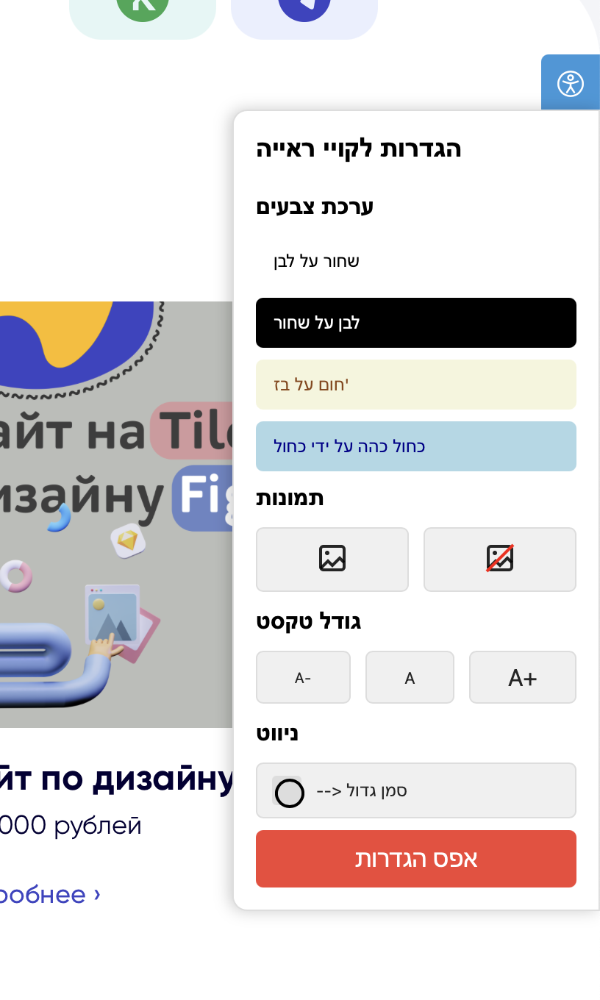

# 🌐 Tilda Accessibility Widget (Israel Law Compliant) 🇮🇱

**Полностью соответствующий законам доступности Израиля виджет для Tilda**, разработанный с учётом потребностей людей с ограниченными возможностями. Лёгко внедряется, не мешает дизайну, работает быстро и стабильно.

---

## 🛠 Особенности

- ✅ **Полное соответствие** требованиям [Израильского закона о доступности веб-сайтов (תקנות נגישות אתרי אינטרנט)](https://www.nevo.co.il/law_html/law01/999_757.htm)
- 🌍 **Интерфейс на иврите** — нативно и понятно для целевой аудитории
- 🧑‍🦯 Поддержка различных ограничений:
  - Нарушения зрения (контраст, увеличение шрифта, чёрно-белый режим)
  - Проблемы с моторикой (навигация с клавиатуры)
  - Светочувствительность (отключение анимации и вспышек)
- ⚡ Лёгкий и быстрый, не замедляет сайт
- 🔧 Лёгкая установка на любую страницу Tilda

---

## 📦 Установка

1. Перейди в Tilda и выберите проект → Настройки сайта → Еще → **HTML-код для вставки внутри HEAD**.
2. Вставь код из файла **Tilda-widget.html** в появившееся поле:

> 🔒 Скрипт не собирает пользовательские данные и не нарушает приватность.

---

## 💬 Пример использования

Панель автоматически появляется сбоку страницы и предлагает настройки доступности, включая изменение контраста, увеличение текста, навигацию с клавиатуры и многое другое.

---

## 📄 Лицензия

Этот проект распространяется на условиях лицензии MIT.

---

## 📬 **Контакты**

Автор: Владислав Лахтионов  
GitHub: [vladelo777](https://github.com/vladelo777)  
Telegram: [@vladelo](https://t.me/vladelo)  

💌 Не забудьте поставить звезду ⭐ на GitHub, если вам понравился бот! 😉
